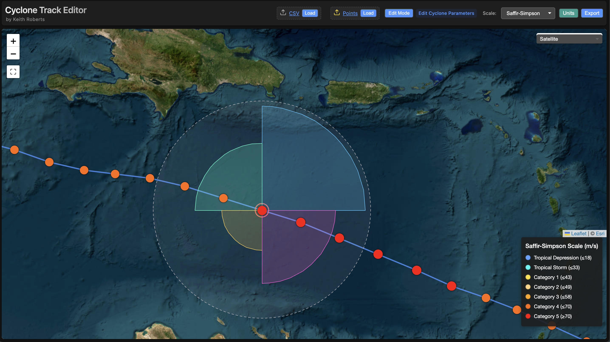
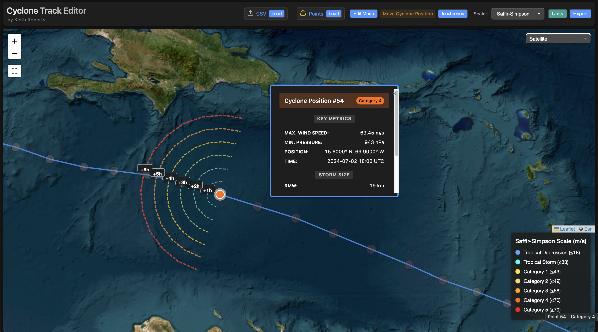
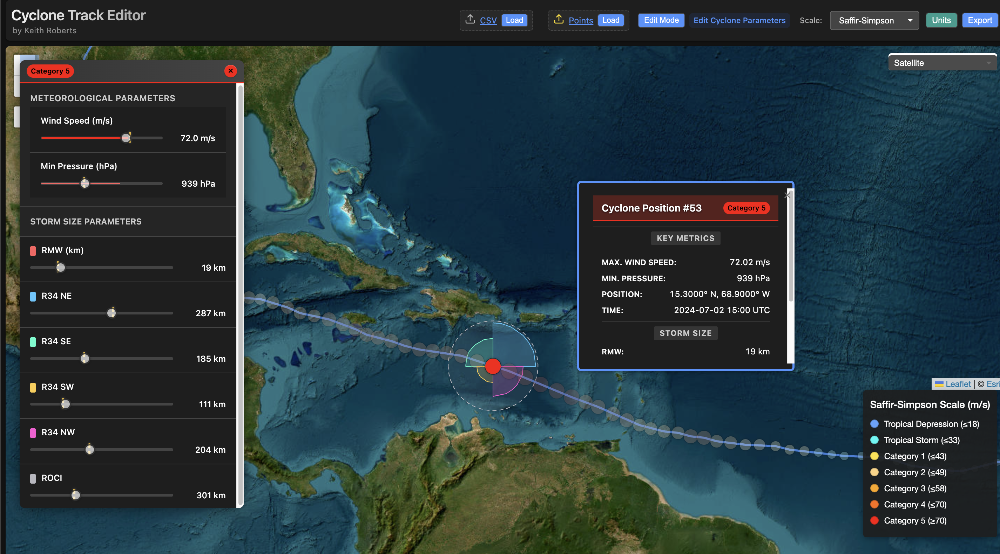

## Cyclone Track Editor/Visualizer


<p align="center">
  
  
</p>

A simple application for visualizing and editing tropical cyclone tracks with meteorological parameters.

## Features

- 📊 Load and visualize CSV tracks and A-deck/B-deck forecast files
- 🗺️ Interactive map with multiple basemap options (Satellite, OpenStreetMap, Terrain, etc.)
- ✏️ Edit storm positions and parameters (wind speed, pressure, RMW, radii)
- 🌀 Visualize storm structure (RMW, R34 radii, ROCI, isochrones)
- 🎨 Color-coded forecast models with category filtering
- ⌨️ Keyboard shortcuts for efficient workflow
- 💾 Export edited tracks to CSV format
- 🖥️ Run as desktop app (Electron) or in browser
- 📐 Support for shapefiles, GeoJSON, and KML overlays
- 🔍 Two-view system: Overview mode for full track, Detailed mode for focused analysis
- 🎯 Automatic transitions: Selecting a point enters detailed view; deselecting returns to overview

## License

This project is licensed under the MIT License - see the [LICENSE.md](LICENSE.md) file for details.

## Documentation

Comprehensive guides are available to help you get started and contribute to the project.

- [User Guide](docs/USER_GUIDE.md): Complete guide to using the application (loading tracks, editing, exporting).
- [Developer Guide](docs/DEVELOPER_GUIDE.md): Setup, architecture, debugging, and contribution guidelines.

For a quick start, see the sections below. For detailed information, refer to the guides above.

## Installation

### Prerequisites
- Node.js 18+ (required for Vite 5)
- npm 9+ (recommended)

### Setup
1. Clone this repository:
   ```
   git clone https://github.com/your-username/cyclone_viewer.git
   cd cyclone_viewer
   ```

2. Install dependencies:
   ```
   npm install
   ```
   This only installs the dependencies, it does not build the application.

## Development Workflow

### Using Vite (Recommended)

Vite provides a modern development experience with hot module replacement (HMR) and optimized builds.

Start development server:
```bash
npm run dev
```
- Starts Vite dev server on http://localhost:5173
- Hot module replacement (HMR)
- Fast cold start and updates

Build for production:
```bash
npm run build
```
- Creates optimized bundle in `dist/`
- Minified and tree-shaken code with source maps

Preview production build:
```bash
npm run preview
```
- Serves the production build locally (default http://localhost:4173)

Run with Electron (Development):
```bash
# Terminal 1: Start Vite dev server
npm run dev

# Terminal 2: Start Electron
npm run dev:electron
```

Run with Electron (Production):
```bash
# Build first
npm run build

# Then run Electron
npm start
```

### Using http-server (Legacy)

The original http-server workflow is still supported:

```bash
npm run serve
```
- Serves files directly without bundling
- No HMR or build optimization
- Useful for quick testing or debugging

## Usage

For detailed usage instructions, see the [User Guide](docs/USER_GUIDE.md).

### Running the application

#### Using Electron (Production)
Run the application using Electron. In production-style runs you must build first:

```
# Build the renderer bundle first
npm run build

# Then start Electron
npm start
```

This launches the application in its own window with full functionality. For development, prefer the dev workflow (`npm run dev` + `npm run dev:electron`).

#### Using a web browser
Recommended for development: `npm run dev` (Vite with HMR). Alternatively, use `npm run serve` for a simple static server. Open http://localhost:5173 in Chrome, Edge, or Firefox.

### Loading cyclone tracks
1. Click the "CSV" button to load cyclone track data
2. Upload a CSV file with the following columns:
- latitude, longitude (required)
- wind_speed (m/s)
- mslp (hPa, minimum central pressure)
- rmw (m, radius of maximum winds)
- r34_ne, r34_se, r34_sw, r34_nw (m, 34-knot wind radii in four quadrants)
 - roci (m, radius of outermost closed isobar)

This application also supports A-deck and B-deck forecast files. Click the "A/B-Deck" button to load forecast data. See the [User Guide](docs/USER_GUIDE.md) for format details and examples.

 ## Hotkeys

The Cyclone Viewer supports several keyboard shortcuts to enhance your workflow:

| Key           | Action                                   |
|---------------|------------------------------------------|
| `Escape` / `c`| Clear all selections and visualizations  |
| `→` (Right)   | Navigate to next storm position          |
| `←` (Left)    | Navigate to previous storm position      |
| `Home`        | Jump to first storm position             |
| `End`         | Jump to last storm position              |
| `M` / `m`     | Jump to maximum intensity point          |
| `+` / `=`     | Navigate to next forecast initialization |
| `-`           | Navigate to previous forecast init       |
| `s` / `S`     | Toggle storm structures visibility       |
| `V` / `v`     | Toggle visualization panel               |
| `Escape×2`    | Quick reset application (double-press)   |

These shortcuts work when the map is in focus. Navigation shortcuts (arrow keys, Home, End, M) work with loaded CSV tracks and will automatically select and display storm attributes for each position. Arrow keys wrap around: pressing Right at the last position returns to the first, and Left at the first returns to the last. The visualization panel (V) provides centralized control over storm structures, isochrones, track lines, and date/time labels, and remembers your preferences between sessions.

Additional keyboard shortcuts for view management and visualization toggles are planned. See the [Developer Guide](docs/DEVELOPER_GUIDE.md) for details, and the [User Guide](docs/USER_GUIDE.md) for the complete keyboard shortcut reference.

Tip: Press `?` anytime to open the in-app Keyboard Shortcuts panel.

#### Example Track Visualization
## Visualization Controls

The application includes a collapsible visualization panel on the right side of the map for centralized control of visual elements:

- Access: Press V to show/hide; click panel header to collapse/expand
- Toggles: Storm Structures, Isochrones, Track Line, Date/Time Labels
- Persistence: Toggle states are saved to your browser storage
- Immediate effect: Changes apply instantly to the map

The panel is semi-transparent and can be collapsed to minimize screen space while staying accessible.




Example visualization showing Hurricane Milton (2024) track with intensity markers and storm structure elements.

## View Modes

The app features a two-view system to streamline analysis:

Overview Mode (Default)
- Shows the entire track; zoom fits all points (~5–6)
- Storm structures and isochrones are hidden to reduce clutter
- Date/time labels render smaller

Detailed Mode (On Selection)
- Activated by selecting a point (click or keyboard)
- Smoothly zooms to the point (~10) and shows storm structures; isochrones appear if enabled in edit mode
- Date/time labels scale up for readability

Switching
- Enter Detailed: Click a marker or navigate with arrow keys/Home/End/M
- Return to Overview: Press Escape or c to deselect, or click “Clear Selections”

Indicator & Persistence
- A badge in the top-right shows 🗺️ Overview or 🔍 Detailed
- View mode and last overview bounds are saved and restored across sessions

## Troubleshooting

### Application Not Loading / Blank Screen

If the application shows a blank screen or the start screen doesn't disappear:

1. Open Browser Console (F12 or Cmd+Option+I)
   - Look for red error messages
   - Common errors:
     - "Cannot use import statement outside a module" → main.js has syntax errors
     - "Leaflet is not defined" → Leaflet library failed to load
     - "Map container not found" → HTML structure issue

2. Check Browser Compatibility
   - Use Chrome, Firefox, or Edge (latest versions)
   - Safari may have ES module issues
   - Ensure JavaScript is enabled

3. Clear Browser Cache
   - Hard refresh: Ctrl+Shift+R (Windows/Linux) or Cmd+Shift+R (Mac)
   - Clear site data in browser settings
   - Try incognito/private mode

4. Verify File Serving
   - Don't open index.html directly (file:// protocol has CORS issues)
   - Use `npm run serve` to start http-server on port 5173
   - Access via http://localhost:5173

5. Check Console Logs
   - Look for "[Main] Initializing application..." message
   - If missing, main.js failed to load or parse
   - Look for "[Map Manager] Map initialization complete"
   - If missing, map initialization failed

### No Basemap Tiles Showing

If the map loads but shows gray/blank tiles:

1. Check Network Connection
   - Open Network tab in browser console
   - Look for failed tile requests (red entries)
   - Tile URLs should return 200 status

2. Try Different Basemap
   - Use basemap selector dropdown (top-right)
   - Try OpenStreetMap (most reliable)
   - Satellite tiles may be blocked by firewall/proxy

3. Check CORS/Firewall
   - Some networks block tile servers
   - Try on different network (mobile hotspot)
   - Check browser console for CORS errors

### Tracks Not Displaying

If files load but tracks don't appear on map:

1. Check Console for Errors
   - Look for "[Adeck Parser]" or "[Track Renderer]" messages
   - Check for parsing errors or invalid data

2. Verify File Format
   - CSV: Must have lat/lon columns
   - A-deck: Must follow ATCF format
   - Check sample files in `data/` directory

3. Check Map Zoom
   - Tracks may be outside current view
   - Press Home key or use "Clear Selections" to reset view

4. Open Browser Console
   - Look for "[Track Renderer] Render complete" message
   - Check marker count and layer count

### Visualization Panel Behind Dialog

If the visualization panel is hidden behind the storm selection dialog:

- This is a known z-index issue
- Collapse the visualization panel (click header)
- Or close the storm dialog temporarily
- Fix: Update styles.css to set `.viz-panel { z-index: 1500; }`

### Tracks Not Appearing

Problem: A-deck or B-deck file loads successfully (log shows "Parsed X tracks") but tracks don't appear on the map.

Solutions:
1. Check if tracks are hidden
   - Open browser console (F12)
   - Type: `window.fixAdeckVisibility()`
   - This makes all tracks visible
   - Reload page to verify

2. Clear stored preferences
   - Old visibility preferences may be hiding tracks
   - Type: `localStorage.removeItem('adeckHiddenTracks')`
   - Reload page

3. Verify tracks loaded
   - Type: `window.trackLayers`
   - Should show object with track IDs
   - If empty: parsing failed, check file format

4. Check map view
   - Tracks may be outside current view
   - Try zooming out or `window.map.setZoom(4)`

### No Basemap Tiles

Problem: Map loads but shows gray/blank background with no tiles.

Solutions:
1. Switch basemap
   - Use basemap selector; try OpenStreetMap (most reliable)

2. Check network
   - Open Network tab in DevTools and look for tile requests

3. Use OSM fallback
   - The app falls back automatically after repeated errors

4. Manual fix
   - `window.map.addLayer(L.tileLayer('https://{s}.tile.openstreetmap.org/{z}/{x}/{y}.png'))`

### Visualization Panel Blocking Dialog

Problem: Cannot click model toggle buttons because visualization panel is covering them.

Solutions:
1. Collapse visualization panel (press 'V' or click the header)
2. In the latest version, z-index is adjusted so the storm dialog appears above the panel

### Emergency Recovery Commands

Open the browser console (F12) and try:
- `window.fixAdeckVisibility()` — Make all tracks visible
- `window.debugMap()` — Show map diagnostic info
- `localStorage.clear()` — Clear all stored preferences
- `window.resetMap()` — Reset map to initial state
- `location.reload()` — Reload page after clearing storage

### Getting Help

If issues persist:

1. Copy all console error messages
2. Note browser version and OS
3. Describe steps to reproduce
4. Check GitHub issues for similar problems
5. Open new issue with details

For Developers:
See `docs/DEVELOPER_GUIDE.md` for detailed debugging instructions and architecture documentation.

### Editing cyclone parameters
1. Click on a storm position to view its details
2. Toggle "Edit Mode" to modify cyclone parameters
3. Drag markers to adjust cyclone position
4. Use the floating dialog to adjust wind speed, pressure, and radii

### Controls
- **Toggle Units**: Switch between metric and imperial units
- **Scale**: Choose between Saffir-Simpson and Australian BoM scales
- **Export**: Export edited track data to CSV

## Building for Distribution

To package the application for distribution:

```
npm run package
```

This will create executables for macOS and Linux in the `release-builds` directory.

### Custom Build Options

You can modify the packaging options in `package.json` to build for additional platforms or customize the output:

```json
"package": "electron-packager . CycloneTracker --platform=darwin,linux,win32 --arch=x64 --out=release-builds --overwrite"

## Development & Debugging

This project includes VS Code debugging configurations for both browser and Electron modes.

VS Code Debugging
- Open the project in VS Code to access pre-configured debug configurations.
- Available configurations: "Launch Chrome (Browser)" and "Launch Electron".

Chrome Debugging
1. Run `npm run serve` to start the development server on port 5173
2. Press F5 or select "Launch Chrome (Browser)" from the Debug panel
3. Set breakpoints in source files and debug in VS Code

Electron Debugging
1. Press F5 or select "Launch Electron" from the Debug panel
2. Debug both main process (`electron-main.js`) and renderer process files
3. Use Ctrl+Shift+I in the Electron window for Chrome DevTools

Alternative Debug Mode
- Run `npm run debug` to launch Electron with Node.js inspector on port 5858
- Attach VS Code debugger to the running process for live debugging

Recommended Extensions
- VS Code will prompt to install recommended extensions on first open
- Key extensions: ESLint, Prettier, Chrome Debugger (see `.vscode/extensions.json`)

For more details, see the [Developer Guide](docs/DEVELOPER_GUIDE.md).

## Contributing

Contributions are welcome! Please read the [Developer Guide](docs/DEVELOPER_GUIDE.md) for setup instructions, architecture overview, and contribution guidelines.

Workflow summary: Fork the repository, create a feature branch, make your changes, and submit a pull request.
